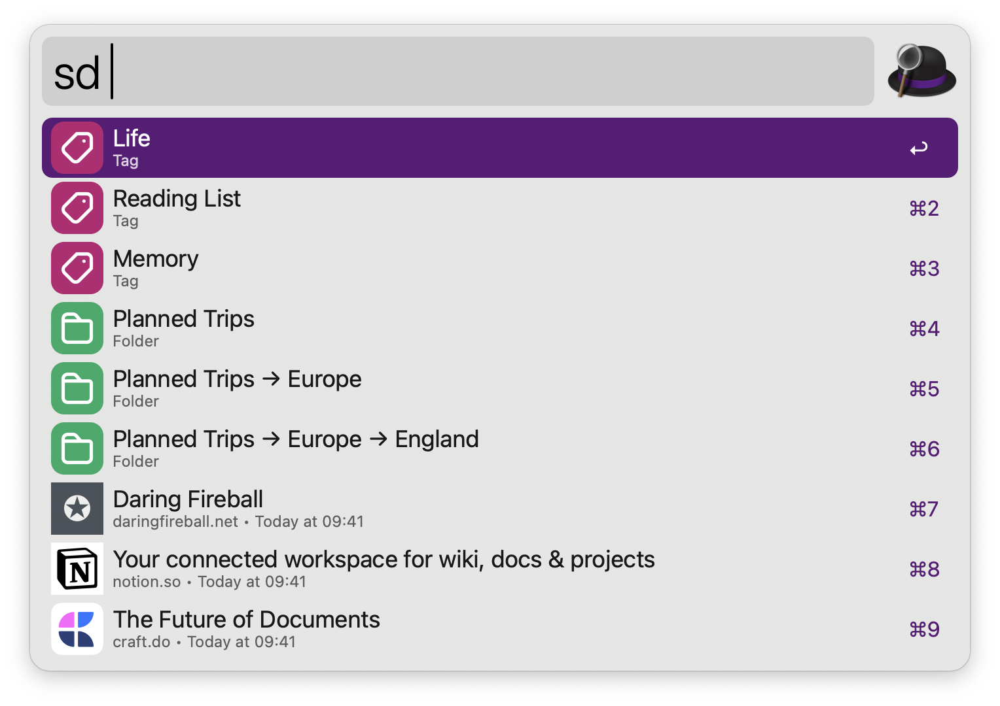
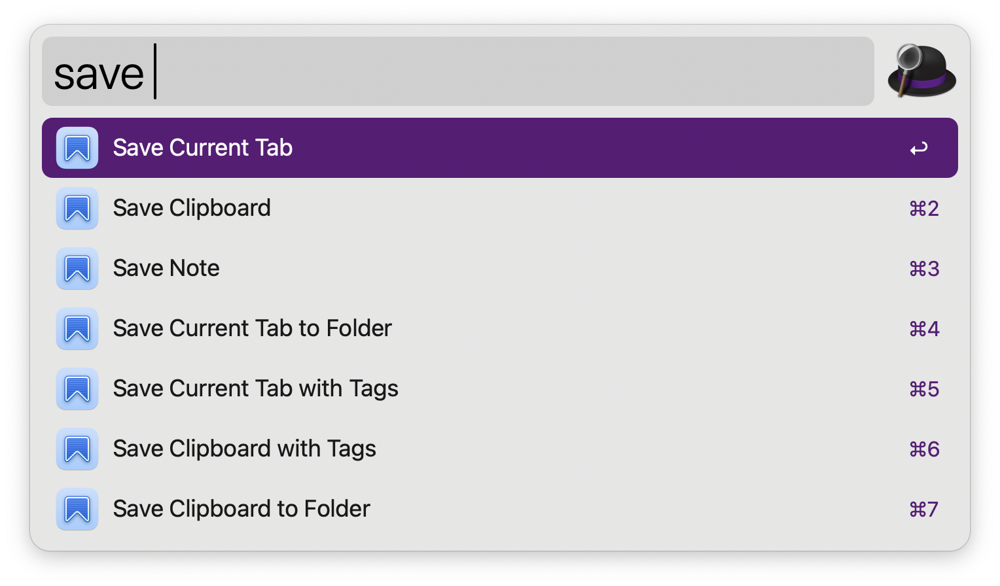

# Alfred Workflow for Anybox

Search links, save links, show Quick Save, toggle Anydock or do other things right in Alfred.




## Supported Version

This workflow is developed and tested with Anybox 2.0 and Alfred 5.

## Install

1. Download [Anybox.alfredworkflow](https://github.com/anyboxhq/anybox-alfred-workflow/raw/main/Anybox.alfredworkflow) and install.

2. Go to “Anybox › Settings › General” to copy API key.

3. Go to “Alfred › Workflows › Anybox › Configure Workflow” to enter API key.

4. Type in default keyword “sd[space]” to search links in Anybox.

For this workflow to work, Anybox needs to be running.

## Supported Actions

1. Search Links

2. Show Quick Save

3. Save Current Tab

4. Save Current Tab with Tags

5. Save Current Tab to Folder

6. Save Clipboard

7. Save Clipboard with Tags

8. Save Clipboard to Folder

9. Save Note

10. Toggle Anydock

11. Toggle Stash Box

12. Toggle Link Detection

13. Switch Anydock Profile

14. Open All in Anydock Profile

15. Show List



## Feature Requests or Bug Reports

Open an issue.

## Trouble Shooting

### “Search Links” Action Not Working

Anybox workflow doesn’t require any third-party dependencies. These actions are developed with shell script and Python 3, which are pre-installed on macOS.

However, in some cases the Python 3 on your Mac maybe not working properly.

So you need to make sure your Mac have a valid Python 3 at `/usr/bin/python3`. To verify, open Termimal.app and type in `/usr/bin/python3`. A valid output should look like this:

```
Python 3.9.6 (default, Oct 18 2022, 12:41:40) 
[Clang 14.0.0 (clang-1400.0.29.202)] on darwin
Type "help", "copyright", "credits" or "license" for more information.
>>> 
```

If your terminal’s output looks like this:
```
xcrun: error: invalid active developer path (/Library/Developer/commandLineTools), missing xcrun at: /Library/Developer/CommandLineTools/usr/bin/xcrun
```

You can fix this with the following instruction from Stack Exchange: [Why am I getting an “invalid active developer path” when attempting to use Git after upgrading to macOS Ventura?](https://apple.stackexchange.com/questions/254380/why-am-i-getting-an-invalid-active-developer-path-when-attempting-to-use-git-a/254381#254381)
